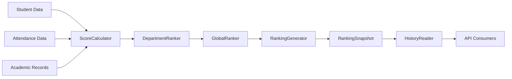

# Ranking Domain Documentation

## 📚 Table of Contents
- [Overview](#overview)
- [Architecture](#architecture)
- [Installation & Setup](#installation--setup)
- [Models & Schemas](#models--schemas)
- [Services](#services)
- [API Endpoints](#api-endpoints)
- [Scoring Rules](#scoring-rules)
- [Scheduling](#scheduling)
- [Authorization Matrix](#authorization-matrix)
- [Error Handling](#error-handling)
- [Monitoring & Health Checks](#monitoring--health-checks)
- [Integration Guide](#integration-guide)
- [Performance Considerations](#performance-considerations)
- [Extending the System](#extending-the-system)

## 📖 Overview

The Ranking Domain is a production-grade module for Nigerian university portals that provides weekly academic rankings of students. It follows a read-only, time-based snapshot architecture with department-based and global rankings.

### Key Features
- **Weekly Ranking Snapshots**: Immutable weekly rankings
- **Department Isolation**: Students only see rankings within their department
- **Global Top 3**: University-wide recognition
- **Historical Analysis**: Full history with trend analysis
- **Rule-Based Scoring**: Configurable scoring engine
- **Automated Generation**: Cron-based weekly updates
- **Performance Optimized**: Indexed queries and pre-aggregation

## 🏗 Architecture

### Folder Structure
```
ranking/
├── index.js                      # Domain entry point
├── ranking.constants.js          # Configuration constants
├── ranking.rules.js              # Scoring rule engine
├── ranking.controller.js         # HTTP controllers
├── ranking.service.js            # Main service layer
├── ranking.scheduler.js          # Cron jobs
├── ranking.routes.js             # Express routes
├── models/
│   ├── RankingSnapshot.model.js  # Immutable weekly snapshots
│   ├── RankingScore.model.js     # Raw score calculations
│   └── indexes.js                # Index management
└── services/
    ├── ScoreCalculator.js        # Score calculation service
    ├── DepartmentRanker.js       # Department ranking logic
    ├── GlobalRanker.js           # Global ranking logic
    ├── HistoryReader.js          # Historical data access
    └── RankingGenerator.js       # Snapshot generation orchestration
```

### Data Flow


## 🚀 Installation & Setup

### 1. Prerequisites
- Node.js 16+
- Express.js 4.x
- MongoDB 4.4+
- Mongoose 6.x

### 2. Installation
```bash
# Copy ranking domain to your project
cp -r ranking/ src/domains/

# Install dependencies
npm install node-cron
```

### 3. Integration
```javascript
// In your main application (app.js or server.js)
import { initializeRankingDomain } from './src/domains/ranking/index.js';

// Initialize with default options
await initializeRankingDomain(app, {
  enableScheduler: process.env.NODE_ENV === 'production',
  rulesConfig: {
    weights: {
      GPA: 0.60,
      ATTENDANCE: 0.25,
      PARTICIPATION: 0.10,
      EXTRA_CREDIT: 0.05
    }
  }
});
```

### 4. Environment Variables
```env
# Ranking Configuration
RANKING_AUTO_GENERATE=true
RANKING_GENERATION_DAY=0              # Sunday (0-6)
RANKING_GENERATION_HOUR=23            # 11 PM
RANKING_GENERATION_MINUTE=59
RANKING_RETENTION_DAYS=365            # Keep snapshots for 1 year
RANKING_GLOBAL_TOP_LIMIT=3
RANKING_DEPARTMENT_TOP_LIMIT=10
```

## 📊 Models & Schemas

### 1. RankingSnapshot Model
Immutable weekly snapshots of rankings.

**Schema Fields:**
```javascript
{
  snapshotId: String,          // Unique snapshot identifier
  period: String,             // 'weekly', 'monthly', 'semester'
  year: Number,               // Year of snapshot
  week: Number,               // ISO week number (1-53)
  validFrom: Date,            // Start of validity period
  validTo: Date,              // End of validity period
  totalStudents: Number,      // Total students ranked
  totalDepartments: Number,   // Total departments included
  averageScore: Number,       // Average score across all students
  
  // Global top rankings
  globalTop: [{
    rank: Number,
    studentId: ObjectId,
    studentName: String,
    matricNo: String,
    departmentId: ObjectId,
    departmentName: String,
    totalScore: Number,
    gpa: Number,
    breakdown: Map<String, Number>
  }],
  
  // Department rankings
  departmentRankings: [{
    departmentId: ObjectId,
    departmentName: String,
    topStudents: [{
      rank: Number,
      studentId: ObjectId,
      studentName: String,
      matricNo: String,
      totalScore: Number,
      gpa: Number
    }],
    departmentStats: {
      averageScore: Number,
      totalStudents: Number,
      highestScore: Number,
      lowestScore: Number
    }
  }],
  
  status: String,             // 'active', 'archived', 'pending'
  generatedBy: ObjectId,      // System user ID
  generationSource: String    // 'cron', 'manual', 'api'
}
```

**Indexes:**
- `{ year: 1, week: 1 }` (unique)
- `{ status: 1, validTo: -1 }`
- `{ 'globalTop.studentId': 1 }`
- `{ 'departmentRankings.departmentId': 1 }`

### 2. RankingScore Model
Raw scores used for snapshot generation.

**Schema Fields:**
```javascript
{
  studentId: ObjectId,        // Reference to User
  departmentId: ObjectId,     // Reference to Department
  year: Number,              // Year of score
  week: Number,              // ISO week number
  totalScore: Number,        // 0-100
  gpa: Number,               // 0-5.0
  attendance: Number,        // 0-100%
  breakdown: Map<String, Number>, // Component scores
  globalRank: Number,        // University-wide rank
  departmentRank: Number,    // Department rank
  calculatedAt: Date,        // When score was calculated
  dataSources: [String]      // Sources used for calculation
}
```

**Indexes:**
- `{ studentId: 1, year: 1, week: 1 }` (unique)
- `{ year: 1, week: 1, departmentId: 1 }`
- `{ year: 1, week: 1, totalScore: -1 }`
- `{ departmentId: 1, year: 1, week: 1, totalScore: -1 }`

## 🔧 Services

### 1. ScoreCalculator
Calculates ranking scores from raw student data.

**Usage:**
```javascript
import ScoreCalculator from './services/ScoreCalculator.js';

const calculator = new ScoreCalculator({
  weights: {
    GPA: 0.60,
    ATTENDANCE: 0.25,
    PARTICIPATION: 0.10,
    EXTRA_CREDIT: 0.05
  }
});

// Calculate score for a single student
const score = await calculator.calculateForStudent(student, {
  year: 2024,
  week: 10,
  department: departmentInfo
});

// Calculate batch of students
const results = await calculator.calculateBatch(students, context);
```

**Custom Rules:**
```javascript
// Add custom scoring rule
calculator.rulesEngine.addRule('research', (student, context) => {
  let score = 0;
  if (student.researchPapers) score += student.researchPapers * 20;
  if (student.conferencePresentations) score += student.conferencePresentations * 15;
  return Math.min(score, 100);
});

// Update weight
calculator.rulesEngine.updateWeight('research', 0.15);
```

### 2. DepartmentRanker
Handles department-specific ranking logic.

**Features:**
- Department top 10 rankings
- Tie handling
- Department statistics
- Trend analysis
- Comparison with previous rankings

**Usage:**
```javascript
import DepartmentRanker from './services/DepartmentRanker.js';

const ranker = new DepartmentRanker();

// Rank students within a department
const ranking = ranker.rankDepartment(scores, department);

// Get trend analysis
const trends = ranker.getStudentTrend(studentId, departmentHistory);

// Compare with previous week
const comparison = ranker.compareWithPrevious(currentRanking, previousRanking);
```

### 3. GlobalRanker
Manages university-wide ranking logic.

**Features:**
- Global top 3 rankings
- Achievement badges
- Global statistics
- Position tracking

**Usage:**
```javascript
import GlobalRanker from './services/GlobalRanker.js';

const ranker = new GlobalRanker();

// Generate global top rankings
const globalTop = ranker.rankGlobal(allScores);

// Get global statistics
const stats = ranker.calculateGlobalStats(allScores);

// Compare rankings week-over-week
const changes = ranker.compareGlobalRankings(currentRankings, previousRankings);
```

### 4. HistoryReader
Provides access to historical ranking data.

**Methods:**
```javascript
// Get current ranking
const current = await historyReader.getCurrentRanking(departmentId);

// Get weekly ranking
const weekly = await historyReader.getWeeklyRanking(2024, 10, departmentId);

// Get department history
const history = await historyReader.getDepartmentHistory(departmentId, {
  limit: 10,
  startDate: '2024-01-01',
  endDate: '2024-03-31'
});

// Get student history
const studentHistory = await historyReader.getStudentHistory(studentId, options);

// Get department trends
const trends = await historyReader.getDepartmentTrends(departmentId, 12);
```

### 5. RankingGenerator
Orchestrates complete snapshot generation.

**Generation Process:**
1. **Fetch Data**: Get student data from various sources
2. **Calculate Scores**: Apply scoring rules to each student
3. **Department Ranking**: Rank students within departments
4. **Global Ranking**: Determine global top 3
5. **Create Snapshot**: Generate and save immutable snapshot

**Usage:**
```javascript
import RankingGenerator from './services/RankingGenerator.js';

const generator = new RankingGenerator(config);

// Generate snapshot
const snapshot = await generator.generateSnapshot({
  period: 'weekly',
  force: false,       // Don't overwrite existing
  notes: 'Weekly generation'
});

// Get generation status
const status = generator.getStatus();
```

## 🌐 API Endpoints

### Base URL: `/api/v1/ranking`

### 1. Student Endpoints

#### GET `/current`
Get current ranking for authenticated student's department.

**Headers:**
```http
Authorization: Bearer <student_token>
```

**Response:**
```json
{
  "success": true,
  "data": {
    "department": {
      "id": "64f7a1b2c3d4e5f6a7b8c9d0",
      "name": "Computer Science"
    },
    "topStudents": [
      {
        "rank": 1,
        "studentId": "64f7a1b2c3d4e5f6a7b8c9d1",
        "studentName": "John Doe",
        "matricNo": "CSC/2021/001",
        "totalScore": 95.5,
        "gpa": 4.8,
        "breakdown": {
          "GPA": 96,
          "ATTENDANCE": 98,
          "PARTICIPATION": 92,
          "EXTRA_CREDIT": 90
        }
      }
    ],
    "statistics": {
      "averageScore": 78.5,
      "totalStudents": 150,
      "highestScore": 95.5,
      "lowestScore": 45.2
    }
  }
}
```

#### GET `/global-top`
Get global top 3 students for the current week.

**Headers:**
```http
Authorization: Bearer <student_token>
```

**Response:**
```json
{
  "success": true,
  "data": {
    "topStudents": [
      {
        "rank": 1,
        "studentId": "64f7a1b2c3d4e5f6a7b8c9d1",
        "studentName": "John Doe",
        "matricNo": "CSC/2021/001",
        "departmentName": "Computer Science",
        "totalScore": 97.2,
        "gpa": 4.9,
        "badge": {
          "type": "gold",
          "icon": "🥇",
          "label": "Top Performer"
        },
        "achievement": "Academic Excellence Award"
      }
    ]
  },
  "meta": {
    "limit": 3,
    "generatedAt": "2024-03-10T23:59:59.999Z"
  }
}
```

#### GET `/student/history`
Get ranking history for authenticated student.

**Query Parameters:**
- `limit`: Number of records (default: 20)
- `offset`: Pagination offset (default: 0)
- `startDate`: Filter from date (ISO format)
- `endDate`: Filter to date (ISO format)

**Response:**
```json
{
  "success": true,
  "data": [
    {
      "snapshotId": "snapshot_1710038399999_abc123def",
      "year": 2024,
      "week": 10,
      "date": "2024-03-10T23:59:59.999Z",
      "globalRank": {
        "rank": 15,
        "score": 88.5,
        "isTop3": false
      },
      "departmentRank": {
        "departmentId": "64f7a1b2c3d4e5f6a7b8c9d0",
        "departmentName": "Computer Science",
        "rank": 3,
        "score": 88.5
      }
    }
  ]
}
```

#### GET `/week/:year/:week`
Get ranking for a specific week.

**Parameters:**
- `year`: Year (e.g., 2024)
- `week`: ISO week number (1-53)

**Query Parameters:**
- `departmentId`: Optional department filter

**Response:** Same structure as `/current`

### 2. Department Endpoints

#### GET `/department/:departmentId/history`
Get ranking history for a specific department.

**Authorization:** Students (own department only), Lecturers, Admin

**Query Parameters:**
- `limit`: Records per page (default: 10)
- `offset`: Pagination offset (default: 0)
- `startDate`: Filter start date
- `endDate`: Filter end date

#### GET `/department/:departmentId/trends`
Get trend analysis for a department.

**Authorization:** Lecturers, Admin, HOD, Dean

**Query Parameters:**
- `weeks`: Number of weeks to analyze (default: 12)

**Response:**
```json
{
  "success": true,
  "data": {
    "trends": [
      {
        "week": 10,
        "year": 2024,
        "averageScore": 78.5,
        "topStudentScore": 95.5,
        "totalStudents": 150,
        "inGlobalTop": true
      }
    ],
    "analysis": {
      "latestScore": 78.5,
      "previousScore": 77.8,
      "averageScore": 76.2,
      "direction": "upward",
      "stability": "high",
      "volatility": 2.3,
      "recommendation": "Maintain current academic support programs"
    }
  }
}
```

### 3. Admin Endpoints

#### POST `/generate`
Trigger manual ranking generation.

**Authorization:** Admin only

**Request Body:**
```json
{
  "force": false,
  "notes": "Manual trigger for testing"
}
```

**Response:**
```json
{
  "success": true,
  "message": "Ranking generation started",
  "data": {
    "snapshotId": "snapshot_1710038399999_abc123def",
    "generationId": "generation_1710038399999",
    "status": "processing"
  }
}
```

#### GET `/generation-status`
Get current generation status.

**Authorization:** Admin only

#### GET `/stats`
Get ranking system statistics.

**Authorization:** Admin, Dean, HOD

#### GET `/health`
Get system health status.

**Authorization:** Admin only

### 4. Scheduler Control Endpoints

#### POST `/scheduler/start`
Start the ranking scheduler.

**Authorization:** Admin only

#### POST `/scheduler/stop`
Stop the ranking scheduler.

**Authorization:** Admin only

#### GET `/scheduler/status`
Get scheduler status.

**Authorization:** Admin only

## ⚙️ Scoring Rules

### Default Scoring Weights
| Component | Weight | Description |
|-----------|--------|-------------|
| GPA | 60% | Academic performance |
| Attendance | 25% | Class attendance rate |
| Participation | 10% | Extracurricular activities |
| Extra Credit | 5% | Research, publications, awards |

### Customizing Rules

**Method 1: Configuration File**
```javascript
// config/ranking.js
export const RANKING_CONFIG = {
  weights: {
    GPA: 0.50,
    ATTENDANCE: 0.30,
    PARTICIPATION: 0.15,
    EXTRA_CREDIT: 0.05
  },
  rules: {
    gpa: (student) => {
      // Custom GPA calculation
      const normalized = (student.gpa / 5.0) * 100;
      return normalized * 1.1; // 10% bonus
    },
    attendance: (student) => {
      // Attendance with progressive scaling
      if (student.attendance >= 90) return 100;
      if (student.attendance >= 80) return 90;
      if (student.attendance >= 70) return 80;
      return student.attendance;
    }
  }
};
```

**Method 2: Runtime Updates**
```javascript
// Update weights at runtime
rankingService.generator.scoreCalculator.updateRules({
  weights: {
    GPA: 0.40,
    ATTENDANCE: 0.30,
    PARTICIPATION: 0.20,
    EXTRA_CREDIT: 0.10
  }
});
```

### Rule Functions
Each rule function receives:
- `student`: Student data object
- `context`: Calculation context (department, semester, etc.)

**Example Custom Rule:**
```javascript
rankingService.generator.scoreCalculator.rulesEngine.addRule(
  'research',
  (student, context) => {
    let score = 0;
    
    // Research papers (20 points each, max 60)
    if (student.researchPapers) {
      score += Math.min(student.researchPapers * 20, 60);
    }
    
    // Conference presentations (15 points each, max 45)
    if (student.conferencePresentations) {
      score += Math.min(student.conferencePresentations * 15, 45);
    }
    
    // Patents (30 points each)
    if (student.patents) {
      score += student.patents * 30;
    }
    
    return Math.min(score, 100);
  }
);
```

## ⏰ Scheduling

### Default Schedule
| Job | Schedule (Lagos Time) | Description |
|-----|----------------------|-------------|
| Weekly Generation | Sunday 23:59 | Generate new weekly snapshot |
| Health Check | Daily 06:00 | System health monitoring |
| Archive | 1st of month 02:00 | Archive old snapshots |

### Customizing Schedule
```javascript
// Update in ranking.constants.js
export const RANKING_CONSTANTS = Object.freeze({
  SNAPSHOT: {
    GENERATION_DAY: 1,        // Monday (0=Sunday, 1=Monday, ...)
    GENERATION_HOUR: 2,       // 2 AM
    GENERATION_MINUTE: 0,     // 0 minutes
    AUTO_GENERATE: true
  }
});
```

### Manual Trigger
```bash
# Using API
curl -X POST http://localhost:3000/api/v1/ranking/generate \
  -H "Authorization: Bearer <admin_token>" \
  -H "Content-Type: application/json" \
  -d '{"force": true, "notes": "Manual generation"}'
```

## 🔐 Authorization Matrix

| Endpoint | Student | Lecturer | HOD | Dean | Admin |
|----------|---------|----------|-----|------|-------|
| `/current` | ✅ | ✅ | ✅ | ✅ | ✅ |
| `/global-top` | ✅ | ✅ | ✅ | ✅ | ✅ |
| `/student/history` | ✅ | ❌ | ❌ | ❌ | ❌ |
| `/week/:year/:week` | ✅* | ✅ | ✅ | ✅ | ✅ |
| `/department/:dept/history` | ✅† | ✅ | ✅ | ✅ | ✅ |
| `/department/:dept/trends` | ❌ | ✅ | ✅ | ✅ | ✅ |
| `/generate` | ❌ | ❌ | ❌ | ❌ | ✅ |
| `/generation-status` | ❌ | ❌ | ❌ | ❌ | ✅ |
| `/stats` | ❌ | ❌ | ✅ | ✅ | ✅ |
| `/scheduler/*` | ❌ | ❌ | ❌ | ❌ | ✅ |

*Students can only view their own department  
†Students can only view their own department's history

## 🚨 Error Handling

### Error Codes
| Code | Description | HTTP Status |
|------|-------------|-------------|
| `NO_CURRENT_SNAPSHOT` | No current ranking snapshot found | 404 |
| `SNAPSHOT_NOT_FOUND` | Snapshot not found for given period | 404 |
| `INVALID_DEPARTMENT` | Invalid department ID or access denied | 400 |
| `GENERATION_IN_PROGRESS` | Ranking generation already in progress | 409 |
| `SNAPSHOT_EXISTS` | Snapshot already exists for period | 409 |
| `UNAUTHORIZED_DEPARTMENT_ACCESS` | Student accessing wrong department | 403 |
| `ADMIN_ONLY` | Endpoint requires admin privileges | 403 |
| `CALCULATION_ERROR` | Score calculation failed | 500 |
| `SNAPSHOT_IMMUTABLE` | Attempt to modify immutable snapshot | 400 |

### Error Response Format
```json
{
  "success": false,
  "error": {
    "code": "UNAUTHORIZED_DEPARTMENT_ACCESS",
    "message": "Students can only view their own department rankings",
    "statusCode": 403,
    "metadata": {
      "departmentId": "64f7a1b2c3d4e5f6a7b8c9d0"
    },
    "timestamp": "2024-03-10T12:00:00.000Z"
  }
}
```

## 🩺 Monitoring & Health Checks

### Health Check Endpoint
```http
GET /api/v1/ranking/health
Authorization: Bearer <admin_token>
```

**Response:**
```json
{
  "status": "healthy",
  "timestamp": "2024-03-10T12:00:00.000Z",
  "service": "ranking",
  "version": "1.0.0",
  "checks": {
    "database": true,
    "generator": true,
    "scheduler": true,
    "currentSnapshot": true,
    "recentGeneration": "2024-03-10T00:00:00.000Z"
  }
}
```

### Health States
- **Healthy**: All systems operational
- **Degraded**: Some non-critical issues
- **Unhealthy**: Critical issues requiring attention

### Monitoring Metrics
```javascript
// Example metrics to monitor
const metrics = {
  generation: {
    duration: 125000, // ms
    studentsProcessed: 1500,
    departmentsProcessed: 15,
    success: true
  },
  queries: {
    averageResponseTime: 45, // ms
    errorRate: 0.01, // 1%
    cacheHitRate: 0.85 // 85%
  },
  system: {
    memoryUsage: 65, // %
    cpuUsage: 42, // %
    activeConnections: 23
  }
};
```

## 🔗 Integration Guide

### 1. Data Source Integration

**Student Service Integration:**
```javascript
// services/StudentDataFetcher.js
class StudentDataFetcher {
  async fetchStudentsForRanking(options) {
    // Fetch from student service
    const response = await studentService.fetch({
      role: 'student',
      isActive: true,
      fields: ['_id', 'matricNo', 'firstName', 'lastName', 'department']
    });
    
    // Fetch academic records
    const academicData = await academicService.getGPAs(studentIds);
    
    // Fetch attendance
    const attendanceData = await attendanceService.getAttendance(studentIds);
    
    // Combine data
    return students.map(student => ({
      ...student,
      gpa: academicData[student._id]?.gpa || 0,
      attendance: attendanceData[student._id]?.percentage || 0,
      // Additional fields...
    }));
  }
}
```

### 2. Event Integration

**Listen for Student Updates:**
```javascript
// Event listeners
eventBus.on('student.updated', async (student) => {
  // Invalidate cache for this student
  rankingService.generator.scoreCalculator.clearCacheForStudent(student._id);
});

eventBus.on('academic.gpaUpdated', async (data) => {
  // Trigger partial recalculation
  await rankingService.generator.calculateAndUpdateScores(data.studentIds);
});

eventBus.on('attendance.updated', async (data) => {
  // Update attendance-based scores
  await rankingService.updateAttendanceScores(data);
});
```

### 3. Webhook Integration

**Ranking Published Webhook:**
```javascript
// Send webhook when ranking is published
rankingService.on('snapshot.published', async (snapshot) => {
  await webhookService.send({
    event: 'ranking.published',
    data: {
      snapshotId: snapshot.snapshotId,
      week: snapshot.week,
      year: snapshot.year,
      globalTop: snapshot.globalTop.slice(0, 3),
      departmentCount: snapshot.departmentRankings.length
    }
  });
});
```

### 4. Integration with Other Domains

**Scholarships Module:**
```javascript
// scholarships.service.js
class ScholarshipService {
  async getEligibleStudents(scholarship) {
    const currentRanking = await rankingService.getCurrentDepartmentRanking(
      scholarship.departmentId
    );
    
    return currentRanking.topStudents
      .filter(student => student.totalScore >= scholarship.minimumScore)
      .slice(0, scholarship.numberOfAwards);
  }
}
```

**Academic Warnings Module:**
```javascript
// warnings.service.js
class WarningService {
  async checkForAcademicWarnings(studentId) {
    const history = await rankingService.getStudentRankingHistory(studentId, {
      limit: 4 // Last 4 weeks
    });
    
    const declining = this.analyzeTrend(history);
    
    if (declining) {
      await this.issueWarning(studentId, 'Academic performance declining');
    }
  }
}
```

**Analytics Dashboard:**
```javascript
// analytics.service.js
class AnalyticsService {
  async getDepartmentPerformance(departmentId) {
    const trends = await rankingService.getDepartmentTrendAnalysis(
      departmentId, 
      12 // Last 12 weeks
    );
    
    return {
      currentRanking: trends.trends[trends.trends.length - 1],
      trendAnalysis: trends.analysis,
      recommendations: this.generateRecommendations(trends)
    };
  }
}
```

## 🚀 Performance Considerations

### 1. Database Optimization

**Index Strategy:**
```javascript
// Critical indexes for performance
rankingSnapshotSchema.index({ year: 1, week: 1 }, { unique: true });
rankingSnapshotSchema.index({ status: 1, validTo: -1 });
rankingSnapshotSchema.index({ 'departmentRankings.departmentId': 1 });
rankingSnapshotSchema.index({ 'globalTop.studentId': 1 });
```

**Query Optimization:**
```javascript
// Use lean() for read-only queries
const snapshots = await RankingSnapshot.find(query)
  .select({ 
    'departmentRankings.$': 1, // Project only needed fields
    year: 1,
    week: 1 
  })
  .lean();

// Use aggregation for statistics
const stats = await RankingSnapshot.aggregate([
  { $match: { status: 'active' } },
  { $group: {
    _id: null,
    avgStudents: { $avg: '$totalStudents' },
    avgScore: { $avg: '$averageScore' }
  }}
]);
```

### 2. Caching Strategy

**Redis Cache Implementation:**
```javascript
// services/RankingCache.js
class RankingCache {
  constructor(redisClient) {
    this.redis = redisClient;
    this.ttl = 3600; // 1 hour
  }
  
  async getCurrentRanking(departmentId) {
    const key = `ranking:current:${departmentId}`;
    const cached = await this.redis.get(key);
    
    if (cached) {
      return JSON.parse(cached);
    }
    
    const ranking = await rankingService.getCurrentDepartmentRanking(departmentId);
    await this.redis.setex(key, this.ttl, JSON.stringify(ranking));
    
    return ranking;
  }
  
  async invalidateDepartment(departmentId) {
    await this.redis.del(`ranking:current:${departmentId}`);
    await this.redis.del(`ranking:history:${departmentId}:*`);
  }
}
```

### 3. Batch Processing

**Efficient Score Calculation:**
```javascript
// Process in batches of 100
const batchSize = 100;
for (let i = 0; i < students.length; i += batchSize) {
  const batch = students.slice(i, i + batchSize);
  
  // Process batch concurrently
  const promises = batch.map(student => 
    calculator.calculateForStudent(student, context)
  );
  
  const batchResults = await Promise.allSettled(promises);
  
  // Handle results...
}
```

### 4. Memory Management

**Stream Processing for Large Datasets:**
```javascript
// Use streams for large student populations
const studentStream = Student.find({ role: 'student' }).cursor();

for await (const student of studentStream) {
  // Process each student
  const score = await calculator.calculateForStudent(student);
  await this.saveScore(score);
  
  // Clear memory periodically
  if (count % 1000 === 0) {
    await this.flushScores();
  }
}
```

## 🧩 Extending the System

### 1. Adding New Ranking Types

**Semester Rankings:**
```javascript
// Add to ranking.constants.js
PERIOD: {
  WEEKLY: 'weekly',
  MONTHLY: 'monthly',
  SEMESTER: 'semester',
  ANNUAL: 'annual'
}

// Create SemesterRanker service
class SemesterRanker extends DepartmentRanker {
  constructor() {
    super();
    this.period = 'semester';
  }
  
  async generateSemesterRanking(semester, year) {
    // Aggregate weekly scores for semester
    const semesterScores = await this.aggregateWeeklyScores(semester, year);
    
    // Generate semester rankings
    return this.rankDepartment(semesterScores);
  }
}
```

### 2. Custom Ranking Algorithms

**Weighted Ranking Algorithm:**
```javascript
class WeightedRanker extends DepartmentRanker {
  constructor(weights) {
    super();
    this.weights = weights;
  }
  
  rankDepartment(scores, department) {
    // Apply custom weights to scores
    const weightedScores = scores.map(score => ({
      ...score,
      weightedScore: this.calculateWeightedScore(score)
    }));
    
    // Sort by weighted score
    const sorted = weightedScores.sort((a, b) => 
      b.weightedScore - a.weightedScore
    );
    
    return this.applyRanking(sorted);
  }
  
  calculateWeightedScore(score) {
    return (
      score.gpa * this.weights.gpa +
      score.attendance * this.weights.attendance +
      score.participation * this.weights.participation
    );
  }
}
```

### 3. Real-time Updates

**WebSocket Integration:**
```javascript
// ranking.websocket.js
class RankingWebSocket {
  constructor(io) {
    this.io = io;
    this.setupListeners();
  }
  
  setupListeners() {
    this.io.on('connection', (socket) => {
      socket.on('subscribe:ranking', (departmentId) => {
        socket.join(`ranking:${departmentId}`);
      });
      
      socket.on('unsubscribe:ranking', (departmentId) => {
        socket.leave(`ranking:${departmentId}`);
      });
    });
  }
  
  broadcastRankingUpdate(snapshot, departmentId) {
    this.io.to(`ranking:${departmentId}`).emit('ranking:updated', {
      snapshotId: snapshot.snapshotId,
      departmentRanking: snapshot.departmentRankings.find(
        d => d.departmentId.toString() === departmentId
      ),
      globalTop: snapshot.globalTop
    });
  }
}
```

### 4. Export Functionality

**Excel Export Service:**
```javascript
// services/RankingExporter.js
class RankingExporter {
  async exportToExcel(snapshot, departmentId) {
    const workbook = new ExcelJS.Workbook();
    const worksheet = workbook.addWorksheet('Rankings');
    
    // Add headers
    worksheet.columns = [
      { header: 'Rank', key: 'rank', width: 10 },
      { header: 'Matric No', key: 'matricNo', width: 15 },
      { header: 'Name', key: 'name', width: 30 },
      { header: 'Total Score', key: 'totalScore', width: 15 },
      { header: 'GPA', key: 'gpa', width: 10 },
      // ... more columns
    ];
    
    // Add data
    const ranking = snapshot.departmentRankings.find(
      d => d.departmentId.toString() === departmentId
    );
    
    ranking.topStudents.forEach(student => {
      worksheet.addRow({
        rank: student.rank,
        matricNo: student.matricNo,
        name: student.studentName,
        totalScore: student.totalScore,
        gpa: student.gpa
      });
    });
    
    // Generate buffer
    return await workbook.xlsx.writeBuffer();
  }
}
```

## 📋 Migration Guide

### Version 1.0 to 1.1

**Breaking Changes:**
- Added new scoring components
- Changed snapshot ID format
- Updated index structure

**Migration Script:**
```javascript
// migration/v1.0_to_v1.1.js
async function migrateRankingData() {
  console.log('Starting ranking data migration...');
  
  // 1. Update snapshot IDs
  await RankingSnapshot.updateMany(
    {},
    [
      {
        $set: {
          snapshotId: {
            $concat: [
              'snapshot_',
              { $toString: { $toLong: '$generatedAt' } },
              '_',
              { $toString: { $rand: {} } }
            ]
          }
        }
      }
    ]
  );
  
  // 2. Create new indexes
  await createRankingIndexes();
  
  // 3. Backfill missing data
  await backfillScoreBreakdowns();
  
  console.log('Migration completed successfully');
}
```

## 🐛 Troubleshooting

### Common Issues

**1. "Generation already in progress"**
```bash
# Check generation lock
GET /api/v1/ranking/generation-status

# Force unlock (admin only)
POST /api/v1/ranking/scheduler/stop
POST /api/v1/ranking/scheduler/start
```

**2. Slow Query Performance**
```javascript
// Check indexes
db.rankingsnapshots.getIndexes()

// Add missing index
db.rankingsnapshots.createIndex({ 
  'departmentRankings.departmentId': 1,
  generatedAt: -1 
})
```

**3. Missing Student Data**
```javascript
// Verify data sources
await rankingService.generator.verifyDataSources();

// Check student service connection
await studentService.healthCheck();

// Manually trigger data refresh
await rankingService.generator.refreshStudentData();
```

### Debug Logging
```javascript
// Enable debug logging
DEBUG=ranking:* npm start

// Check specific components
DEBUG=ranking:generator,ranking:scheduler npm start
```

## 📈 Scaling Considerations

### Horizontal Scaling
```javascript
// Use Redis for distributed locks
const Redlock = require('redlock');
const redlock = new Redlock([redisClient], {
  driftFactor: 0.01,
  retryCount: 10,
  retryDelay: 200
});

// Acquire lock for generation
const lock = await redlock.lock(
  'ranking:generation:lock',
  60000 // 60 second TTL
);

try {
  await rankingService.generateSnapshot();
} finally {
  await lock.unlock();
}
```

### Database Sharding
```javascript
// Shard by year for historical data
rankingSnapshotSchema.index({ year: 1 }, { 
  shardKey: true 
});

// Shard by department for current data
rankingScoreSchema.index({ departmentId: 1 }, {
  shardKey: true
});
```

## 🔧 Maintenance Tasks

### Weekly Tasks
1. Verify generation completed successfully
2. Check system health metrics
3. Review error logs
4. Validate data integrity

### Monthly Tasks
1. Archive old snapshots
2. Update scoring rules if needed
3. Review performance metrics
4. Backup ranking data

### Quarterly Tasks
1. Analyze ranking trends
2. Update weight configurations
3. Optimize database indexes
4. Review system capacity

## 📞 Support

### Getting Help
1. **Documentation**: Review this document first
2. **Logs**: Check application logs for errors
3. **Metrics**: Review performance metrics
4. **Community**: University tech team forum

### Reporting Issues
```bash
# Include in bug reports
1. Error message and code
2. API endpoint and parameters
3. Timestamp of occurrence
4. Relevant logs (sanitized)
5. Steps to reproduce
```

---

## 🎯 Summary

The Ranking Domain provides a robust, scalable solution for academic rankings in Nigerian universities. Key strengths include:

1. **Modular Architecture**: Clean separation of concerns
2. **Extensible Design**: Easy to add new ranking types
3. **Performance Optimized**: Efficient queries and caching
4. **Comprehensive Monitoring**: Built-in health checks
5. **Production Ready**: Error handling, logging, and scaling

For implementation assistance or custom modifications, contact the university's technical team or refer to the source code documentation.